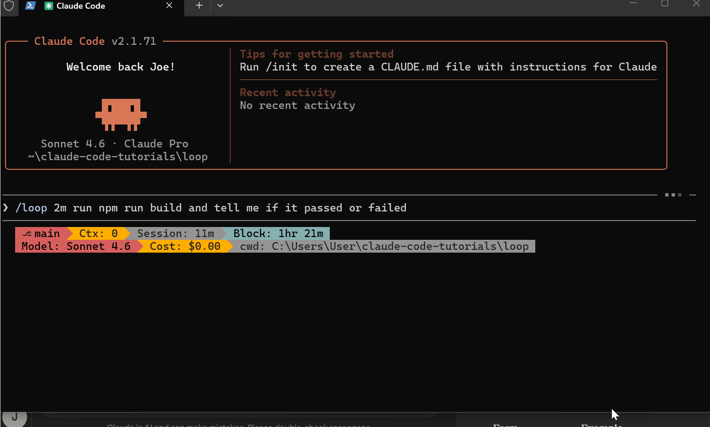

<CoverSlide
  eyebrow="FGV EAESP"
  title="Claude Code: Seu terminal turbinado"
  subtitle="Claude code e seu papel no desenvolvimento assistido por IA"
  presenter="R. M. Ferrari"
  location="São Paulo, SP"
  date="Maio de 2026"
/>

---

# Quem sou eu?

<CircularImage 
src="https://github.com/ramonferrari.png" 
size="180px"
borderColor="var(--rf-highlight)"
:scale="1.1"
x="120"
y="200"
/>

<div class="prose" style="position: absolute; right: 60px; top: 180px; width: 550px; font-size: 1.1rem; line-height: 1.6;">

- Baiano, 15 anos no RJ, 2 anos em Vitória.
- Atuação por ~15 anos em processamento de dados sísmicos
- Coordenador e Cientista de Dados na Petrobras
- Doutorando em Adm. de Empresas (FGV EAESP)
  - Qualidade de informação em sistemas de LLM
</div>


---


# O que a IA sabe

<AIKnowledge />

---

# A IA não tem memória. Tem mesa de trabalho.

<Contextdesk />

---

# Corrida das IAs

<AICompetition />

---

# Modelo leve × pro

<ModelComparison />

---

# Os Dois Conflitos da IA

<div class="flex items-center gap-8 mt-4" style="font-size: 1.6rem; line-height: 1.6;">
<div class="glass p-6 flex-1" style="border-color: rgba(99,211,161,0.45); text-align: center;">
<span style="color: #63d3a1; font-weight: 700;">🧠 Fiel ao treinamento</span><br> 
Ser completa. Agradar. Parecer confiante. Nunca deixar de responder.
</div>
<div style="font-size: 2rem; font-weight: 700; flex-shrink: 0; text-align: center; opacity: 0.45; letter-spacing: 0.1em;">vs</div>
<div class="glass p-6 flex-1" style="border-color: rgba(226,248,27,0.45); text-align: center;">
<span style="color: #e2f81b; font-weight: 700;">📋 Seguir suas instruções</span>  
Ser precisa. Dizer N/E. Citar a fonte. Usar só o que está no documento.
</div>
</div>
<div class="grid grid-cols-3 gap-2 mt-3" style="font-size: 0.85rem; line-height: 1.35;">
<div v-click class="glass p-5" style="border-top: 3px solid #EC635E;">
<span style="color: #EC635E; font-weight: 700;">"Se não encontrar, põe N/E"</span>
Treinamento: resposta vazia não agrada.
→ IA inventa **8%** com total confiança.
</div>
<div v-click class="glass p-5" style="border-top: 3px solid #EC635E;">
<span style="color: #EC635E; font-weight: 700;">"Extraia só o valor total"</span>
Treinamento: ser completo é ser útil.
→ IA adiciona interpretações e avisos que ninguém pediu.
</div>
<div v-click class="glass p-5" style="border-top: 3px solid #EC635E;">
<span style="color: #EC635E; font-weight: 700;">"Use só o documento enviado"</span>
Treinamento: multas ficam entre 5–10%.
→ IA "preenche" cláusula vaga com conhecimento geral.
</div>
</div>
---
layout: center
class: "text-center"
---

# Do Chat ao Agente
## O que é o Claude Code?

---

# O que é uma LLM "normal"?

<div class="grid gap-8 mt-4 items-center" style="grid-template-columns: 1fr 1fr;">
<div class="rf-panel">

**Modelo de chat tradicional**
- Você escreve uma mensagem
- O modelo responde com texto
- Você copia, aplica, testa manualmente
- Sem acesso ao seu ambiente
</div>
<div>
<Terminal
  :conversation="[{ user: 'Como leio um arquivo JSON em Python?', response: 'Use o módulo json com json.load sobre o arquivo aberto. Agora copie, cole no seu editor e rode você mesmo — eu não tenho acesso ao seu projeto.' }]"
  modelName="ChatGPT"
/>
</div>
</div>

---

# O ciclo manual

<LoopChatManual />

---

# O que é o Claude Code?

<div class="grid gap-4 mt-4 items-center" style="grid-template-columns: 3fr 2fr;">
<div>
<p class="!mt-0">
<strong>Claude Code</strong> é um <strong>ambiente de codificação agêntico</strong> da Anthropic que vive no seu terminal.
</p>
<ul>
  <li v-click>Diferente de um chatbot: ele <strong>lê arquivos, executa comandos, faz alterações e resolve problemas</strong> de forma autônoma.</li>
  <li v-click>Você descreve o que quer → Claude explora, planeja e implementa.</li>
  <li v-click>Disponível via terminal, e integrações com VS Code ou JetBrains.</li>
</ul>
<Callout v-click type="info" class="!mt-3 !px-3 !py-2">
Requer uma conta Anthropic (planos Pro, Team ou Enterprise para uso completo).
</Callout>
</div>
<div v-click>
<LoopAgentico />
</div>
</div>

---

# Por que Claude Code importa?

<div class="grid grid-cols-2 gap-8 mt-6">
<div>
<HighlightStat value="40%+" label="Aumento de produtividade" class="!text-5xl" />
<p class="rf-muted text-sm text-center -mt-2">Aumento de produtividade reportado por times da Anthropic que seguem as melhores práticas.</p>
</div>
<div>
<HighlightStat value="30%" label="Mais rápido para debuggar" class="!text-5xl" />
<p class="rf-muted text-sm text-center -mt-2">30% mais rápido para debuggar usando o ciclo de feedback adaptativo do agente.</p>
</div>
</div>

<div class="mt-8">
<Subtitle text="Casos de uso reais" />
<div class="grid grid-cols-5 gap-3 mt-3 text-center" style="font-size: 0.75rem;">
  <div v-click class="glass p-3">
    <div class="text-2xl mb-1">🗺️</div>
    Onboarding e Exploração de Codebases
  </div>
  <div v-click class="glass p-3">
    <div class="text-2xl mb-1">🔀</div>
    Migração de Frameworks
  </div>
  <div v-click class="glass p-3">
    <div class="text-2xl mb-1">🕵️</div>
    Revisão de Código Automatizada
  </div>
  <div v-click class="glass p-3">
    <div class="text-2xl mb-1">🧪</div>
    Geração e Correção de Testes
  </div>
  <div v-click class="glass p-3">
    <div class="text-2xl mb-1">📊</div>
    Análise de Dados via CLI
  </div>
</div>
</div>

---

# A Restrição Fundamental

<div class="flex flex-col ">
<Contextdesk />

</div>

---

# O Context Window: Detalhes

<div>
<ul style="font-size: 1.1rem; line-height: 1.8;">
  <li>A <em>constraint</em> mais importante: <strong>o context window se enche rapidamente</strong>.</li>
  <li>Cada mensagem, arquivo lido e saída de comando consome tokens.</li>
  <li v-click>A performance <strong>degrada</strong> à medida que o contexto se aproxima do limite.</li>
  <li v-click>O agente pode "esquecer" instruções do início da sessão.</li>
</ul>

<Callout v-click type="warning" class="!mt-8">
Gerenciar o contexto é a habilidade #1 do Claude Code.
</Callout>

</div>

---
layout: center
class: "text-center"
---

# Uso do Claude Code

---

# Instalação e Configuração Inicial

<div>
<p>Execute sempre <strong>dentro do diretório raiz do projeto</strong>. O agente performa muito melhor sobre uma árvore de código funcional e testável.</p>
<p class="!mt-4">O comando <code>/init</code> gera um <code>CLAUDE.md</code> inicial analisando a estrutura do seu projeto.</p>

```bash
# Instalação global via npm
npm install -g @anthropic-ai/claude-code

# Autenticação (apenas uma vez)
claude auth login

# Iniciar no diretório do projeto
cd meu-projeto
claude
```
</div>

::note::
Vamos à prática. A instalação é simples via npm. O ponto crítico é: sempre execute o Claude dentro do diretório raiz do seu projeto. Se seu projeto não builda ou os testes não rodam, corrija isso primeiro. O comando /init é seu primeiro passo em qualquer projeto novo.
::

---

# O Arquivo CLAUDE.md: A Base de Tudo

<div class="grid grid-cols-2 gap-6">

<div class="prose glass p-4" style="font-size: 0.9rem; padding: 0.75rem;">
<h4 class="!mt-0 !text-green-400">O que incluir ✅</h4>
<ul>
  <li>Comandos de build/teste que o agente não adivinha.</li>
  <li>Estilo de código específicas do projeto.</li>
  <li>Convenções do repositório (ex: branches, commits).</li>
  <li>Apontadores para documentação ("API em /docs/api.md").</li>
</ul>
</div>

<div class="prose glass p-4">
<h4 class="!mt-0 !text-red-400">O que NÃO incluir ❌</h4>
<ul>
  <li>Coisas que o agente já sabe pelo código.</li>
  <li>Convenções padrão da linguagem (ex: "use ; em JS").</li>
  <li>Documentação de API inteira (use um link).</li>
  <li>Explicações longas ou tutoriais.</li>
</ul>
</div>

</div>

---

# Hierarquia do `CLAUDE.md`

<div class="flex flex-col items-center">
<p class="mb-4" style="max-width: 700px;">O agente carrega <strong>múltiplos</strong> arquivos <code>CLAUDE.md</code> em uma hierarquia, permitindo regras globais, de time e pessoais.</p>

<table class="rf-table" style="margin: 0.5rem auto;">
  <thead>
    <tr>
      <th>Localização</th>
      <th>Escopo</th>
      <th>Versionado?</th>
    </tr>
  </thead>
  <tbody>
    <tr>
      <td><code>~/.claude/CLAUDE.md</code></td>
      <td>Global (pessoal)</td>
      <td class="text-center">❌ Não</td>
    </tr>
    <tr>
      <td><code>./CLAUDE.md</code></td>
      <td>Projeto (time)</td>
      <td class="text-center">✅ Git</td>
    </tr>
    <tr>
      <td><code>./CLAUDE.local.md</code></td>
      <td>Projeto (pessoal)</td>
      <td class="text-center">❌ .gitignore</td>
    </tr>
    <tr>
      <td><code>./src/CLAUDE.md</code></td>
      <td>Subdiretório</td>
      <td class="text-center">✅ Git</td>
    </tr>
  </tbody>
</table>
</div>

---

# Estrutura em Monorepos

<div class="flex flex-col items-center mt-4">
<pre style="font-size: 1.1rem; line-height: 1.8; background: transparent; padding: 0; font-family: monospace;">
~/.claude/CLAUDE.md (global)
    └── projeto/
        ├── CLAUDE.md (time)
        ├── CLAUDE.local.md (pessoal)
        ├── src/
        │   └── CLAUDE.md (frontend)
        └── api/
            └── CLAUDE.md (backend)
</pre>
<p class="rf-muted mt-6">Ótimo para monorepos com regras diferentes para frontend e backend.</p>
</div>


---

# Modos de Permissão

<p style="opacity: 1; margin-bottom: 1.5rem;">Controle o nível de autonomia do agente com 4 modos de permissão. Use <code>/permissions</code> para mudar de modo durante a sessão.</p>

<div class="grid grid-cols-4 gap-3 mt-4 text-sm">
  <div class="glass p-4">
    <h3 class="!mt-0 !text-base !font-bold">Default</h3>
    <p class="!text-xs !opacity-80">Pede aprovação para <strong>cada ação</strong>. Ideal para iniciantes e para trabalhar em código sensível.</p>
  </div>
  <div class="glass p-4">
    <h3 class="!mt-0 !text-base !font-bold">Plan</h3>
    <p class="!text-xs !opacity-80"><strong>Somente leitura</strong>, sem modificações. Perfeito para exploração de codebase, planejamento e code review.</p>
  </div>
  <div class="glass p-4">
    <h3 class="!mt-0 !text-base !font-bold">AcceptEdits</h3>
    <p class="!text-xs !opacity-80">Aprova <strong>mudanças de arquivos</strong> automaticamente. Ótimo para sprints de desenvolvimento ativo.</p>
  </div>
  <div class="glass p-4">
    <h3 class="!mt-0 !text-base !font-bold">Auto</h3>
    <p class="!text-xs !opacity-80">Classificador aprova <strong>ações seguras</strong> automaticamente. Para runs autônomas e CI/CD.</p>
  </div>
</div>

<DecisionFlow class="mt-4" />

::note::
Os modos de permissão são chave. Default é seguro, mas tedioso. O segredo dos power-users é mudar de modo conforme a fase do trabalho. Comece em Plan para entender, mude para AcceptEdits para implementar.
::
---
layout: center
class: "text-center"
---

# O Fluxo de Trabalho Ideal

---

# Explorar → Planejar → Implementar → Commitar

<p class="text-left mt-4">O workflow de 4 fases recomendado pela Anthropic para evitar resolver o problema errado.</p>
<div class="prose text-left text-sm">
<ol>
  <li class="!pl-0">
    <strong class="text-green-300">Explorar (Plan mode)</strong>
    <p class="!text-xs !opacity-100 !-mt-1"><code style="color: white;">leia /src/auth e entenda como gerenciamos sessões.</code></p>
  </li>
  <li class="!pl-0">
    <strong class="text-yellow-300">Planejar (Plan mode)</strong>
    <p class="!text-xs !opacity-100 !-mt-1"><code style="color: white;">Quero adicionar OAuth com Google. Quais arquivos precisam mudar? Crie um plano detalhado.</code></p>
  </li>
    <li class="!pl-0">
    <strong class="text-blue-300">Implementar (Default/AcceptEdits)</strong>
    <p class="!text-xs !opacity-100 !-mt-1"><code style="color: white;">Implemente o fluxo OAuth do seu plano. Escreva testes para o callback handler e corrija qualquer falha.</code></p>
  </li>
    <li class="!pl-0">
    <strong class="text-purple-300">Commitar</strong>
    <p class="!text-xs !opacity-100 !-mt-1"><code style="color: white;">Faça o commit com uma mensagem descritiva e abra um PR.</code></p>
  </li>
</ol>
<p style="margin-top: 1.5rem; opacity: 1;">Separe exploração e planejamento da implementação.</p>
</div>

::note::
Este é o padrão de workflow mais importante. Deixar o agente pular direto para o código pode gerar código tecnicamente correto, mas que resolve o problema errado. Use o `Plan mode` para explorar sem risco. Para tarefas pequenas, pode pular o planejamento.
::

---

# Prompts e Contexto

<div class="grid grid-cols-2 gap-4 mt-2">
<div class="glass p-4">
<h4 class="!mt-0 !text-red-400">❌ Vago</h4>
<p class="!text-sm">"adicione testes para foo.py"</p>
<hr class="!my-2 opacity-20">
<p class="!text-sm">"corrija o bug de login"</p>
<hr class="!my-2 opacity-20">
<p class="!text-sm">"adicione um widget de calendário"</p>
</div>
<div class="glass p-4">
<h4 class="!mt-0 !text-green-400">✅ Específico</h4>
<p class="!text-sm">"escreva um teste para <strong>@foo.py</strong> cobrindo o edge case onde o usuário está deslogado. <strong>evite mocks</strong>."</p>
<hr class="!my-2 opacity-20">
<p class="!text-sm">"usuários reportam falha no login após timeout. verifique o fluxo em <strong>@src/auth/</strong>. escreva um <strong>teste que reproduza o problema</strong>, depois corrija."</p>
<hr class="!my-2 opacity-20">
<p class="!text-sm">"siga o padrão de <strong>@HotDogWidget.php</strong> para implementar um novo widget de calendário, <strong>sem bibliotecas externas</strong>."</p>
</div>
</div>
<p class="text-center mt-4">A precisão das suas instruções determina a qualidade dos resultados.</p>

---

# Deixe o agente se auditar

<p class="!mt-0">O agente para quando o trabalho "parece pronto". Sem verificação, <strong>VOCÊ</strong> vira o loop de feedback.</p>

<div class="grid grid-cols-2 gap-8 items-center mt-4">
<div>
<p><strong>Estratégias de verificação explícita:</strong></p>
<ul>
  <li><strong>Testes:</strong> <span style="color: #e2f81b;">"...Implemente e <strong>execute os testes</strong>. Corrija as falhas."</span></li>
  <li><strong>Build/Lint:</strong> <span style="color: #e2f81b;">"...implemente e <strong>verifique que <code style="color: #63d3a1;">npm run build</code> passa</strong> sem erros."</span></li>
  <li><strong>UI Visual:</strong> <span style="color: #e2f81b;">"<span style="color: #63d3a1;">[cole screenshot]</span> ...implemente e <strong>compare com o design original</strong>."</span></li>
  <li><strong>Causa Raiz:</strong> <span style="color: #e2f81b;">"O build falha com erro <span style="color: #63d3a1;">[erro]</span>. <strong>Corrija a causa raiz</strong>, não apenas suprima o erro."</span></li>
</ul>

</div>
<div>

<p class="text-center text-xs rf-muted">Com verificação, o agente fecha o loop de correção automaticamente.</p>
</div>
</div>

---
layout: center
class: "text-center"
---

# Funcionalidades Avançadas

---

# Comandos Essenciais

<Spacer :h="20"/>

<div class="grid grid-cols-2 gap-6">

<div>
<ul>
  <li><code>/clear</code>: Reseta o context window completamente. <strong>Use entre tarefas não relacionadas.</strong></li>
  <li><code>/compact</code>: Comprime o histórico, preservando o mais importante.</li>
  <li><code>/rewind</code>: Abre um menu de checkpoints para desfazer ações ou restaurar a conversa.</li>
  <li><code>--continue</code>: Retoma a sessão mais recente exatamente de onde parou.</li>
</ul>
</div>

<div>
<Callout type="warning" class="!h-full">
<h4 class="!mt-0">Regra Prática</h4>
Se você corrigiu o agente mais de <strong>2 vezes</strong> sobre o mesmo problema, pare. Use <code>/clear</code> e reescreva o prompt com o que você aprendeu.
<br/><br/>
Uma sessão limpa com um prompt melhor quase sempre supera uma sessão longa com correções acumuladas.
</Callout>
</div>

</div>


---

# Padrões Comuns de Falha (E Como Evitá-los)

<div class="grid grid-cols-2 gap-4 mt-4">

<div v-click class="glass p-4 border-l-4 border-red-500">
<h5 class="!mt-0">"A Sessão Cozinha de Tudo"</h5>
<p class="text-sm !-mt-0">Você mistura tarefas não relacionadas, poluindo o contexto com informações irrelevantes.</p>
✅ Solução: <span class="text-sm font-bold text-green-400 !mb-1"> Use <code>/clear</code> entre tarefas distintas.</span>
</div>

<div v-click class="glass p-4 border-l-4 border-red-500">
<h5 class="!mt-0">"A Espiral de Correções"</h5>
<p class="text-sm !-mt-0">O agente erra, você corrige, ele erra de novo em um loop frustrante.</p>
✅ Solução: <span  class="text-sm font-bold text-green-400 !mb-0">Após 2x, <code>/clear</code> e melhore o prompt.</span>
</div>

<div v-click class="glass p-4 border-l-4 border-red-500">
<h5 class="!mt-0">"O CLAUDE.md Monstro"</h5>
<p class="text-sm !-mt-0">O arquivo é tão longo que o agente começa a ignorar regras importantes.</p>
✅ Solução: <span class="text-sm font-bold text-green-400 !mb-0">Seja impiedoso. Se o agente já faz algo certo sem a regra, delete-a.</span>
</div>

<div v-click class="glass p-4 border-l-4 border-red-500">
<h5 class="!mt-0">"A Exploração Infinita"</h5>
<p class="text-sm !-mt-0">Você pede para "investigar" sem escopo, e o agente lê centenas de arquivos.</p>
✅ Solução: <span class="text-sm font-bold text-green-400 !mb-0">Use subagentes para exploração ou dê um escopo claro.</span>
</div>
</div>


---

# Subagentes: Delegação Inteligente

<div class="grid grid-cols-2 gap-8 items-center">
<div>
<p>Subagentes são como assistentes que rodam em <strong>context windows próprios e isolados</strong>, retornando apenas um resumo para o agente principal.</p>
<p class="!mt-4"><strong>Casos de uso:</strong></p>
<ul>
  <li><strong>Investigação:</strong> "use um subagente para investigar como nosso sistema de autenticação lida com token refresh."</li>
  <li><strong>Revisão de código:</strong> "use um subagente para revisar este código por edge cases de segurança."</li>
</ul>
</div>
<div class="text-center">
<svg viewBox="0 0 500 250" class="mx-auto" style="max-width: 100%;">
  <!-- Main Context Box -->
  <rect x="20" y="50" width="180" height="150" fill="none" stroke="#e2f81b" stroke-width="2" rx="8"/>
  <text x="110" y="78" text-anchor="middle" fill="#e2f81b" font-weight="bold" font-size="5">Main</text>
  <text x="110" y="100" text-anchor="middle" fill="#e2f81b" font-weight="bold" font-size="5">Context</text>
  <text x="110" y="120" text-anchor="middle" fill="#9ca3af" font-size="3">(Preservado)</text>
  <circle cx="110" cy="150" r="2" fill="#e2f81b"/>
  <circle cx="110" cy="160" r="2" fill="#e2f81b"/>
  <circle cx="110" cy="170" r="2" fill="#e2f81b"/>
  
  <!-- Subagent Context Box -->
  <rect x="300" y="50" width="180" height="150" fill="none" stroke="#ec4899" stroke-width="2" rx="8" stroke-dasharray="5,5"/>
  <text x="390" y="78" text-anchor="middle" fill="#ec4899" font-weight="bold" font-size="5">Subagent</text>
  <text x="390" y="100" text-anchor="middle" fill="#ec4899" font-weight="bold" font-size="5">Context</text>
  <text x="390" y="120" text-anchor="middle" fill="#9ca3af" font-size="3">(Isolado)</text>
  <rect x="330" y="132" width="120" height="45" fill="none" stroke="#ec4899" stroke-width="1" rx="4" opacity="0.5"/>
  <text x="390" y="150" text-anchor="middle" fill="#ec4899" font-size="3">Exploração</text>
  <text x="390" y="165" text-anchor="middle" fill="#ec4899" font-size="3">Investigação</text>
  
  <!-- Arrow from Main to Subagent -->
  <path d="M 205 100 L 300 100" stroke="#9ca3af" stroke-width="2" fill="none"/>
  <polygon points="300,100 290,95 290,105" fill="#9ca3af"/>
  <text x="252" y="85" text-anchor="middle" fill="#9ca3af" font-size="3">spawn</text>
  
  <!-- Arrow from Subagent back to Main (Result) -->
  <path d="M 300 140 L 205 140" stroke="#10b981" stroke-width="2" fill="none"/>
  <polygon points="205,140 215,145 215,135" fill="#10b981"/>
  <text x="252" y="154" text-anchor="middle" fill="#10b981" font-size="3">resultado</text>
</svg>
<p class="text-xs rf-muted">O contexto principal não é poluído pela exploração do subagente.</p>
</div>
</div>


---

# Sessões Paralelas com Git Worktrees

<p class="!mt-0">A dica #1 do criador do Claude Code para máxima produtividade: trabalhe em múltiplas tarefas simultaneamente.</p>
<div class="grid grid-cols-2 gap-8 items-center mt-4">
<div style="background: #1a1a2e; border-radius: 8px; padding: 16px; font-family: 'JetBrains Mono'; font-size: 0.85rem; color: #e0e0e0; line-height: 1.6;">
  <div style="color: #ffd000; margin-bottom: 8px;">bash</div>
  <div>$ git worktree add ../proj-feature-auth feature/auth</div>
  <div>$ git worktree add ../proj-bugfix-login bugfix/login</div>
  <div style="margin-top: 8px;">$ cd ../proj-feature-auth && claude</div>
  <div>$ cd ../proj-bugfix-login && claude</div>
  <div style="margin-top: 12px; color: #63d3a1;">Duas sessões rodando em paralelo, contextos isolados!</div>
</div>
<div>
<p><strong>Benefícios:</strong></p>
<ul>
  <li>Edições não colidem entre as sessões.</li>
  <li>Cada agente tem seu próprio contexto limpo.</li>
  <li>Desenvolvimento e revisão de código em paralelo real.</li>
</ul>
</div>
</div>
---
layout: center
class: "text-center"
---

# E agora?


---

# Os 10 Mandamentos do Claude Code
<div class="grid grid-cols-2 gap-x-8 gap-y-2 mt-4 text-left prose-sm">
  <div v-click class="flex items-center gap-2">1. Gerencie o <strong>context window</strong> acima de tudo.</div>
  <div v-click class="flex items-center gap-2">2. <strong>Explore</strong>, depois <strong>planeje</strong>, depois implemente.</div>
  <div v-click class="flex items-center gap-2">3. Seja <strong>específico</strong> nos prompts (use <code>@</code>).</div>
  <div v-click class="flex items-center gap-2">4. Dê ao agente como <strong>verificar</strong> seu trabalho.</div>
  <div v-click class="flex items-center gap-2">5. Mantenha <code>CLAUDE.md</code> <strong>conciso</strong> e focado.</div>
  <div v-click class="flex items-center gap-2">6. Use <code>/clear</code> <strong>agressivamente</strong> entre tarefas.</div>
  <div v-click class="flex items-center gap-2">7. Use <strong>subagentes</strong> para exploração e revisão.</div>
  <div v-click class="flex items-center gap-2">8. Crie <strong>slash commands</strong> para workflows repetitivos.</div>
  <div v-click class="flex items-center gap-2">9. Paralelize com <strong>git worktrees</strong>.</div>
  <div v-click class="flex items-center gap-2">10. <strong>Versione</strong> tudo que for compartilhado no Git.</div>
</div>

<div v-click class="mt-8">
<Callout type="info">Os 3 mais importantes: gerenciar <strong>contexto</strong>, separar <strong>planejamento</strong> da implementação, e incluir <strong>verificação</strong>.</Callout>
</div>


---

# Obrigado

<Spacer :h="20"/>

<div class="rf-center" style="display: flex; flex-direction: column; align-items: center; text-align: left;">

<div style="width: 560px; max-width: 90%;">
<Terminal
  :conversation="[{ user: 'E aí, o que vamos construir?', response: 'Você decide.\nEu já estou no terminal, pronto para agir.' }]"
  modelName="Claude Sonnet 4.5"
  :loop="false"
/>
</div>

<div style="margin-top: 2rem; display: flex; flex-direction: column; align-items: center; justify-content: center; gap: 1.2rem; width: 100%;">
  <div style="font-size: 1.6rem; color: #e2f81b; font-weight: 700; text-align: center;">Ramon Ferrari</div>
  <div style="width: 80px; height: 1px; background: linear-gradient(90deg, transparent, #e2f81b, transparent);"></div>
  <div style="display: flex; gap: 1.2rem; justify-content: center;">
    <a href="mailto:ramon.ferrari@gmail.com" style="display: inline-flex; align-items: center; justify-content: center; gap: 0.5rem; padding: 0.6rem 1.2rem; background: rgba(232, 132, 90, 0.15); border: 1px solid rgba(232, 132, 90, 0.4); border-radius: 6px; color: #e8845a; text-decoration: none; font-size: 0.85rem; transition: all 0.3s; min-width: 120px;">
      <carbon:email style="width: 1.1em; height: 1.1em;" /> Email
    </a>
    <a href="https://linkedin.com/in/ramonferrari" target="_blank" style="display: inline-flex; align-items: center; justify-content: center; gap: 0.5rem; padding: 0.6rem 1.2rem; background: rgba(91, 164, 245, 0.15); border: 1px solid rgba(91, 164, 245, 0.4); border-radius: 6px; color: #5ba4f5; text-decoration: none; font-size: 0.85rem; transition: all 0.3s; min-width: 120px;">
      <carbon:logo-linkedin style="width: 1.1em; height: 1.1em;" /> LinkedIn
    </a>
  </div>
</div>

</div>

